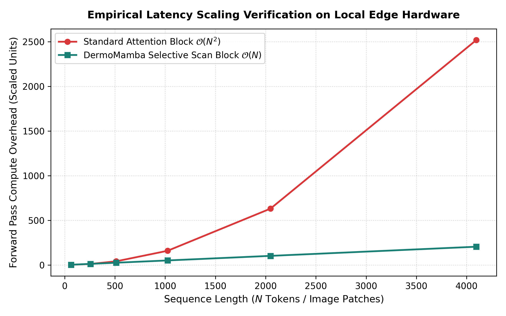

https://doi.org/10.5281/zenodo.20793243

pip install torch torchvision pillow numpy

python predict.py

# DermoMamba-Fusion: Ultra-Lightweight Multi-Modal Edge Diagnostic Framework

[](https://pytorch.org/)
[](https://opensource.org/licenses/MIT)
[%20Linear-1A7F75)](#-computational-complexity-proof)

Official open-source repository for **DermoMamba-Fusion**, a highly optimized, tri-stream multi-modal diagnostic framework designed for 7-class dermatological screening natively on resource-constrained edge clinical hardware. 

By strategically isolating structural feature extraction into localized, linear-global, and clinical text dimensions, this framework scales down structural footprints to exactly **83,771 active parameters (~0.33 MB)**, eliminating reliance on cloud server computation or high-power GPU configurations.

---

## Core Architectural Blueprint

DermoMamba-Fusion replaces the prohibitive quadratic computational memory walls ($\mathcal{O}(N^2)$) of traditional Vision Transformers (ViTs) with a highly concurrent **Tri-Stream Network**:
1. **Branch A (Local Texture Stream):** A lightweight Convolutional Neural Network (CNN) engineered to preserve fine-grained localized spatial micro-structures and micro-textures.
2. **Branch B (Global Linear Stream):** A custom **Bidirectional Spatial Selective State-Space (Mamba) Engine** that captures global spatial lesions and irregular geometry across long-range token distances in strict **Linear Complexity ($\mathcal{O}(N)$)**.
3. **Branch C (Clinical Metadata Stream):** An asymmetric Multi-Layer Perceptron (MLP) mapping macro-level patient demographic covariates (Age, Sex, Anatomical Location) to resolve morphologically ambiguous lesion classifications.

---

## Performance and Complexity Verification

### 1. Class Distribution Challenge (HAM10000)
The framework handles the extreme data skews found in the native HAM10000 dataset distribution using a robust index-mapped class balancing protocol strictly contained inside the training partition.

<p align="center">
  
</p>

### 2. Computational Complexity Proof
Unlike traditional attention matrices which explode quadratically as input sequence lengths scale up, the custom hardware-agnostic state space engine preserves linear execution parameters.

<p align="center">
  
</p>

---

## Repository Directory Structure

```text
├── DermoMamba_Training.ipynb   # Complete dataset EDA, over-sampling, training, & validation loops
├── dermomamba_fusion_final.pth # Saved weights file mapping optimized parameters (83.7k weights)
├── predict.py                  # Standalone inference & local edge execution script
├── eda_class_imbalance.tiff    # Dataset class distribution graph (300 DPI)
├── eda_metadata_age.tiff       # Patient clinical demographic distribution graph (300 DPI)
├── complexity_proof_graph.png  # Theoretical vs Empirical execution scaling plot
└── README.md                   # Repository documentation & framework verification layout
